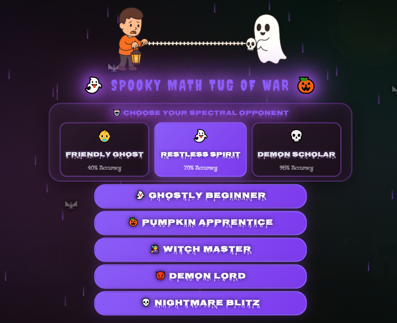
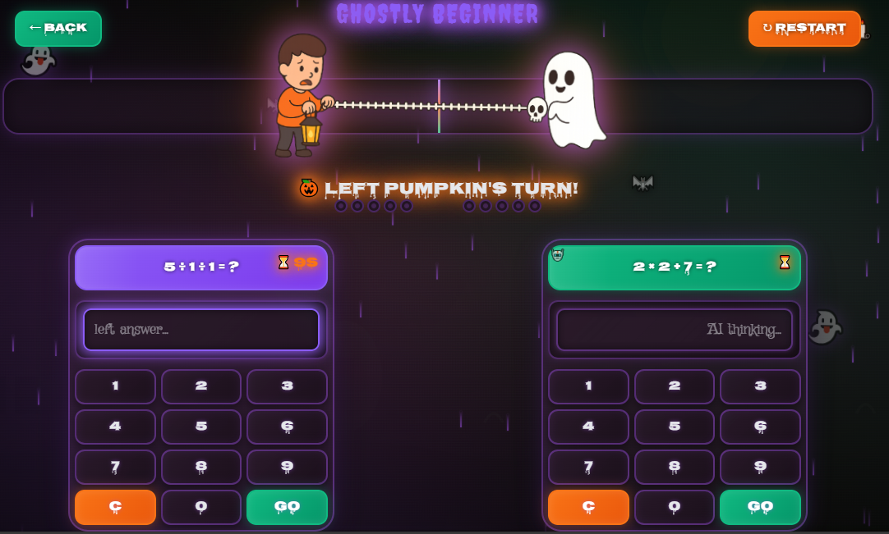

# 🎃 Spooky Math Tug of War  
**Spooky Math Tug of War** is a Halloween-themed educational math game where players compete against an AI opponent by solving arithmetic problems. Each correct answer pulls the character toward your side of the battlefield — increasing tension with spooky animations, sound effects, and a fully immersive Halloween vibe.

---

## 🕹️ Live Demo  
🎯 **Play it here:**  
👉 https://joese6.github.io/SpookyMathTugOfWar/

---

## 📸 Screenshots  
### Homepage  

### Gameplay  

---

## 👻 Features
- 🎃 Fully spooky-themed UI/UX  
- 🧮 Random multi-operation math challenges  
- 👤 Player vs. AI (manual mode retained)  
- 🧟 Halloween sound effects (bats, thunder, wolf, bell, etc)  
- 🧛 Animated characters reacting to correct/incorrect answers  
- ⚡ Dynamic tug-of-war progress bar  
- 🔧 Built with **HTML**, **CSS**, **JavaScript**, and enhanced using **Kiro** (hooks, steering, specs)
